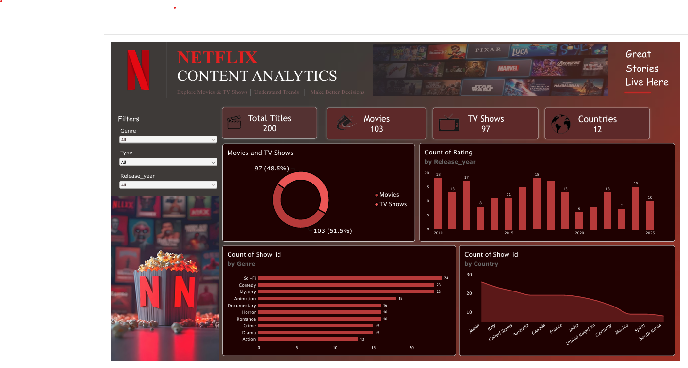

# Netflix Dashboard - Power BI

Interactive Netflix dashboard built with Power BI to analyze movies and TV shows.

## Dashboard Preview

## Objective
To explore Netflix content and understand trends by type, genre, country, and release year using an interactive Power BI dashboard.

## Dashboard Features
- KPI cards: Total Titles, Movies, TV Shows, Countries
- Filters: Genre, Type, Release Year
- Charts: Movies vs TV Shows (donut), Titles by Release Year, Titles by Genre, Titles by Country

## Key Insights
- The dataset has 200 titles: 103 Movies (51.5%) and 97 TV Shows (48.5%), spread across 12 countries.
- Sci-Fi is the most common genre (24 titles), followed by Comedy and Mystery (23 each). Action is the least common (13).
- Japan has the highest number of titles, followed by Italy and the United States. South Korea has the lowest.
- Titles per release year peaked at 18 (2010 and 2017) and dropped to the lowest, 6, in 2020.

## Dataset
- File: `Netflix_Data.xlsx`
- Columns: Show_id, Type, Genre, Country, Release_year, Rating

## Tools Used
- Power BI
- DAX
- Power Query
- MS Excel

## Skills Practiced
- Data cleaning and modeling in Power Query
- Building KPI cards and interactive visuals
- Using slicers (filters) to explore data
- Dashboard design and layout

## Files in this Repository
- `Netflix_Dashboard.pbix` - Power BI project file
- `Netflix_Dashboard.pdf` - Dashboard PDF
- `Netflix_Data.xlsx` - Dataset
- `dashboard.png` - Dashboard screenshot

## How to Open
Download the `.pbix` file and open it in Power BI Desktop.

## Author
Priyanka R

GitHub: [Priyanka-R05](https://github.com/Priyanka-R05)
